# MedChain
A mobile application built to store patient health records using blockchain, IPFS and React Native


|  |   | |
| --- | --- | --- |
| 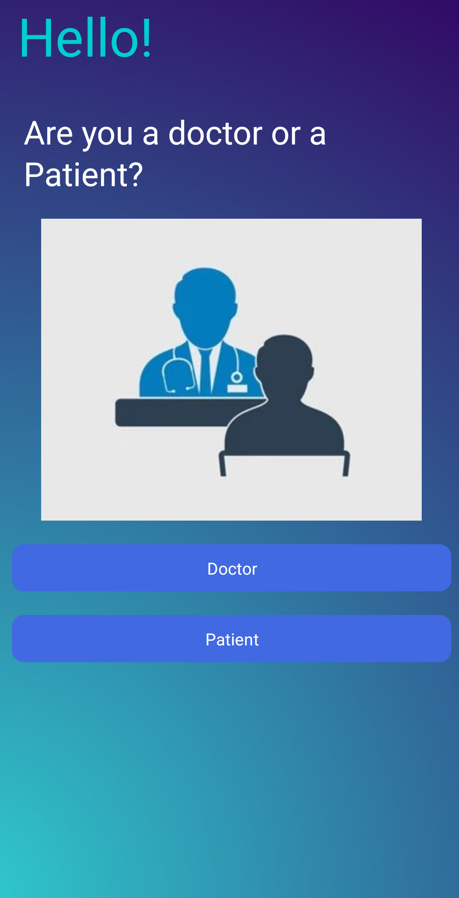  |  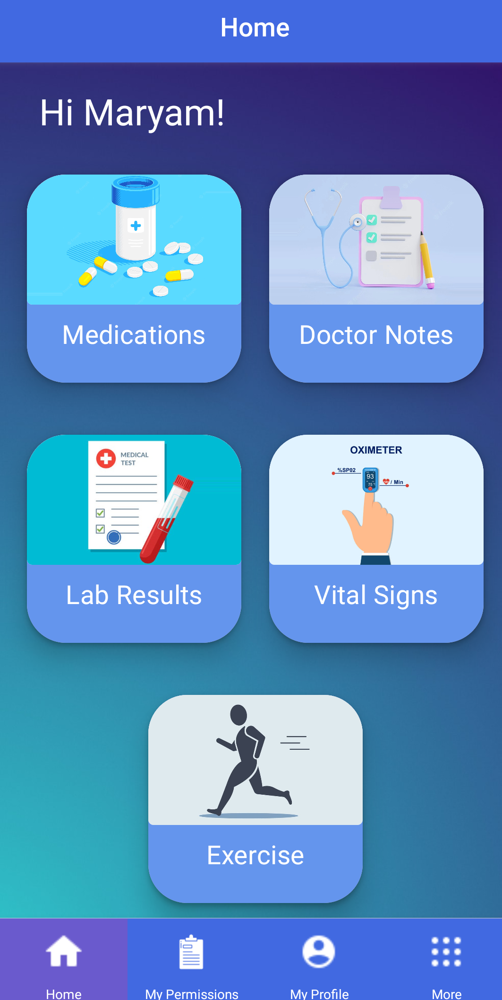 | 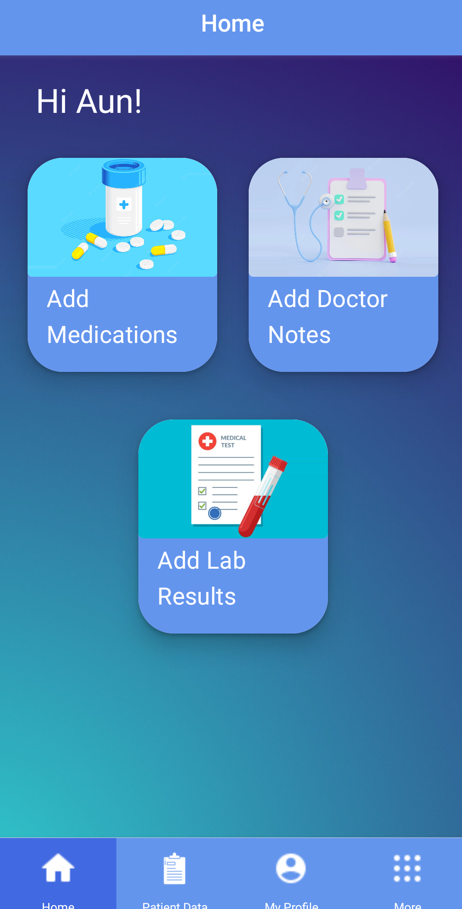 |


## Objective

Organizations have inconsistent and fragmented health records that can create inefficiencies across healthcare systems.

This app aims to provide a single electronic health record system having secure, immutable and traceable data stored on a blockchain


### Patient:

This app gives patient control over their health records and also give them the power to share their health records. 


### Doctor:

Using this app doctors can add patient's health records. Also they can view the health records shared with them. 


## High Level Architecture
---

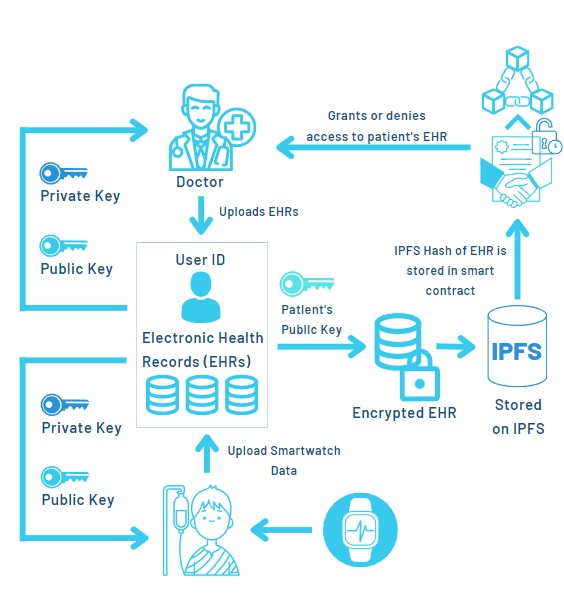


## Features
---
* Save medical information of Patients on blockchain (Implemented)

* Development of system that allows doctor to add clinical notes, prescriptions and 
lab test results of patients (Implemented)

* Patient can give access to only authorized doctors to see their record (Implemented)

* Patient can give time limited access to doctors to see their records (Implemented)

* Integration of App with smartwatch (Implemented)

* Tracking and recording physical activity of Patient (Implemented)

* Token based reward system on the basis of patient physical  

* Ranking System on the basis of tokens earned by use (To be Implemented)

## App Development
---
The frontend of mobile application is developed using react native that will help users in using the application. After that a REST API backend is created using node js and express which will handle the requests coming from the frontend.


## Storage of Health Records
---

Doctors can add the health records of the patient. For this we use IPFS as storing a large amount of data on Blockchain can be very energy consuming.

When the doctor adds the health record of a patient, the data is encrypted with the public key of the patient and is stored on the IPFS. After that the hash of the file is stored in the smart contract. Later the patient can view his health records by getting the hash of the file from IPFS and decrypting the data of the file with his private key.

|  |   | |
| --- | --- | --- |
| 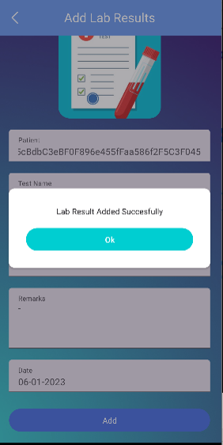  |  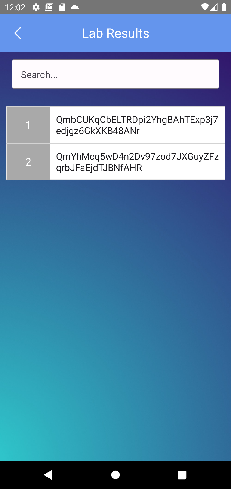 | 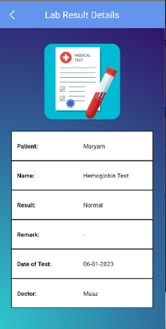 |


## Smart Contract Implementation
---
Three smart contracts are implemented:
- First smart contract i.e Roles.sol stores a mapping of patients and their roles. Account address of the patient is used as key whereas role is used as a value. The role can either be “Doctor” or “Patient”. Roles.sol is used in Permissions.sol to manage access control based on the roles assigned.
-	Permissions.sol used to manage permissions to the doctor by the patient. GrantPermission and RevokePermission sets a bool value against a doctor for each file to determine whether a doctor has access or not. Permission.sol is used in IPFS.sol to manage permissions to the files stored on the IPFS.
-	IPFS.sol is used to store the file hash and some metadata about the file. IPFS.sol stores a mapping of all the files with an integer as a key and the file hash as the value.


## Smart Contract Testing
---
We have written javascript tests using mocha and chai. 

Run:
```
truffle test
```
Output:

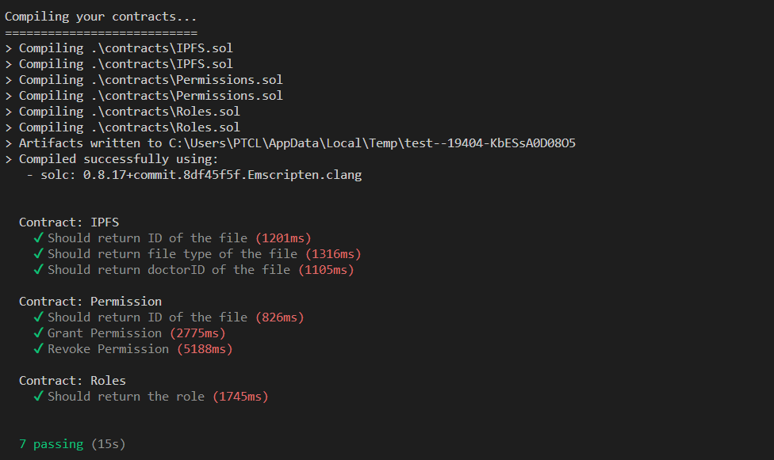

## Health Record Permissions
---
Patient can give access of his/her medical records to doctors for which proxy re-encryption is used. Patient can also view the permission he/she have given.

|  |   | |
| --- | --- | --- |
| 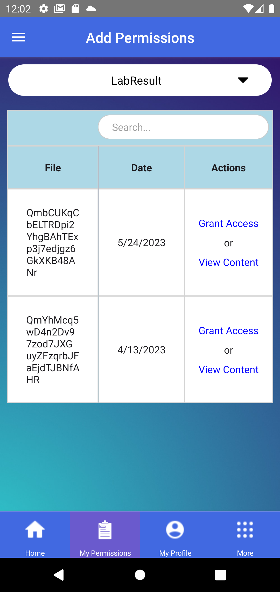  |  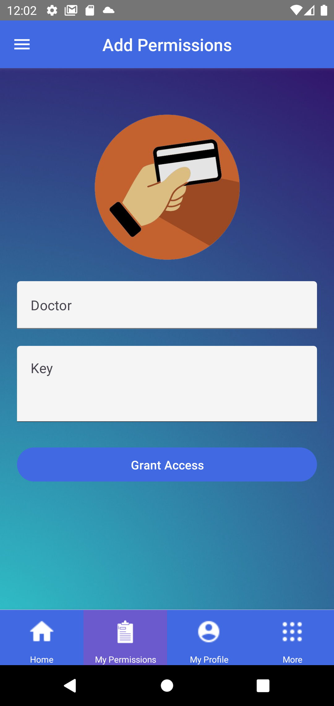 | 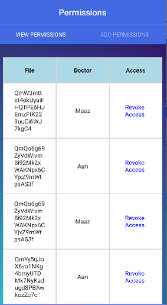 |


## Proxy Re-encryption Algorithm
--- 
When the patient wants to grant permission of his health records to the doctor, the smart contract retrieves the hash of the file. As the file is encrypted with the patient's public key, he needs to share his private key with the doctor with whom he wants to share the health record which we do not want.

So we use another method for this, that is Proxy re-encryption.

The proxy re-encryption method creates a secret key using the patient's private key and doctor public key and the data that is already encrypted with the patient's public key is re-encrypted with that secret key which can now be decrypted with the doctor's private key. 

Output:

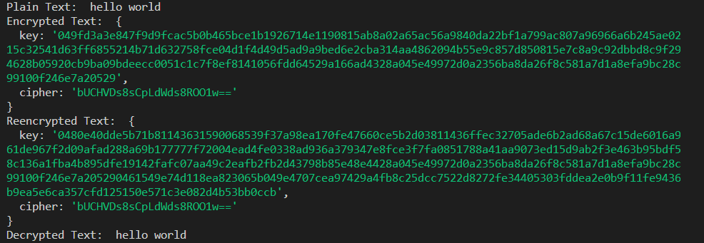

## Smart Watch Integration
React Native mobile app is integrated with a smartwatch using Google Fit. Google Fit is a health tracking platform that allows users to track their physical activity, such as steps taken and sync this data with other applications. By integrating Google Fit with our React Native app, we can provide users with a seamless experience that allows them to track their fitness data both on their mobile devices and on their smartwatches. 

|  |   | |
| --- | --- | --- |
| 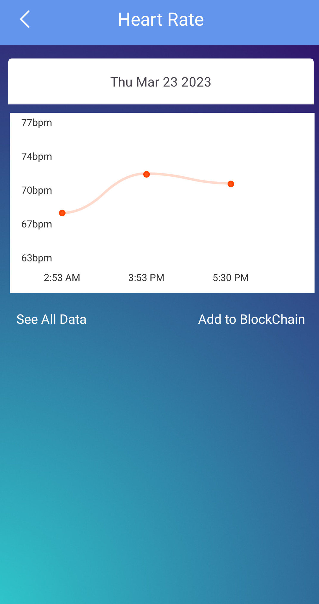  |  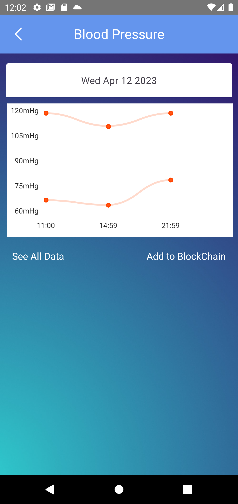 | 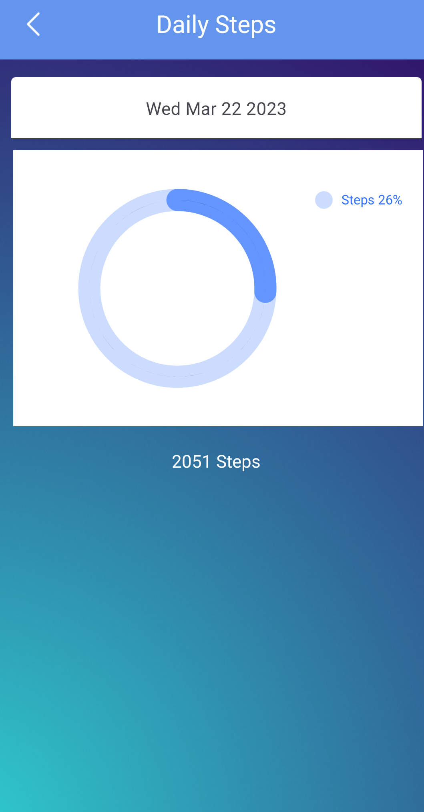 |

## Database 
---
For storing patient and doctor account information, we need a database. For this we use mongodb integrated with node js.

All the user account information like his id, name, password is stored in the database at the time of account creation and later this information is used for login. For security purposes we store the hash of the password in the database instead of the original password.


## Developmemt Requirements
---
React-Native

Truffle

Ganache

IPFS

Node Js 

MongoDB

## Installations
---
Install following libraries for mobile app

```
npm install react-native-paper@5.0.0-rc.8

npm install @react-navigation/native

npm install @react-navigation/native-stack

npm install @react-navigation/bottom-tabs

npm install react-native-paper-grid

npm install react-native-easy-grid

npm install react-native-modal-datetime-picker 

npm install react-native-document-picker  

npm install @react-navigation/material-top-tabs react-native-tab-view

npm install react-native-screens react-native-safe-area-context

npm i react-native-pager-view

npm i @react-native-async-storage/async-storage --force
```
Install following libraries for backend
```
npm install

npm install express --save

npm install -g nodemon

npm install -g mongoose

npm install crypto

npm install body-parser

npm install express-fileupload

npm install cors

npm install bcrypt

npm install ipfs-only-hash

npm install ipfs-http-client

npm install recrypt-js
```

## Quick Start
---

First clone the repository

```
git clone https://github.com/MaryamNaveed/FinalYearProject.git
```

After Cloning install the required libraries. Then run mobile app using following command:

```
npm run android
```

Run node server using follwing command:

```
nodemon app.js
```